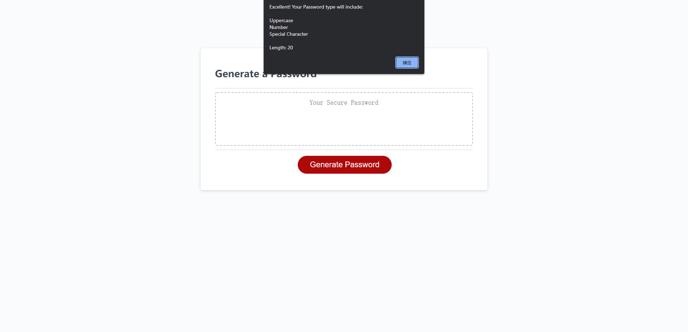
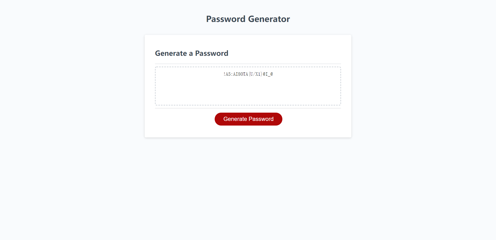

# UCSD_HW3_Password-Generator
This is the HW 3 of bootcamp, where I need to modify starter code to create an application that enables employees to generate random passwords based on criteria that they’ve selected.

## User Story

```
AS AN employee with access to sensitive data
I WANT to randomly generate a password that meets certain criteria
SO THAT I can create a strong password that provides greater security
```

## What I've done

I mainly paid my attention into coding script.js file. In this .js file, I create the function which would ask user to choose some conditions about the password, and generate a random password once all conditions are chosen successfully.

The function will ask the following questions:

* Ask user to enter the **Length** of password. (If user doesn't type the number between 8-128, it will show a warning and re-ask the length of password.)

* Ask user to choose the types of password they expect within lowercase/uppercase/number/special characters. (If user choose **all no** with 4 conditions, it will show a warning and re-ask those 4 conditions again until user chooses at least one of them.)

* Once all conditions are chosen, it will show all conditions the user chosen at last for summary, so no worries if the user forgot what they chosen.

## Screenshot with two moment.

### The summary once user finishes chosen all conditions.


### The Result once the passwors is generated and shows on the screen.
